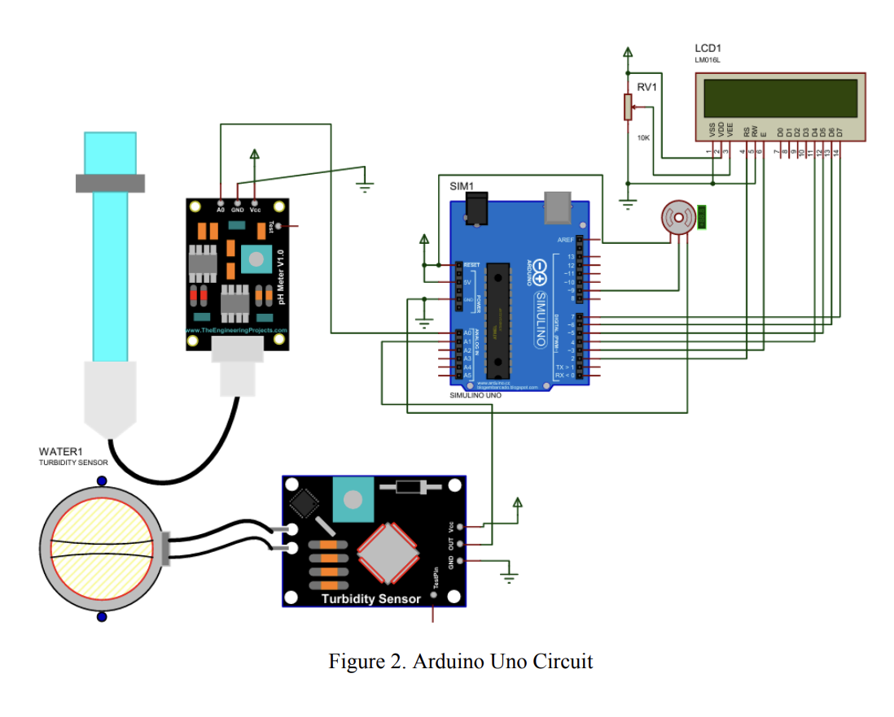

# rainwater-filtration-system
 An efficient Rainwater Collecting System with a Water Quality-Based Filtration System to promote sustainable water management practices.
# Rainwater Collecting System with Water Quality-Based Filtration System

This repository contains the implementation of a **Rainwater Harvesting System** that dynamically monitors and filters rainwater based on real-time quality metrics using sensors and an Arduino-based setup.

## 💧 Project Overview

This project addresses water scarcity and promotes sustainable water practices by:
- Capturing rainwater via a collection system.
- Analyzing water quality through sensors (pH, turbidity).
- Automatically filtering water using an Arduino-controlled system.

## 📁 Important Figures and Files

Arduino Circuit 
- 

## 🧰 Components

- **Arduino Uno** – Main microcontroller for system logic.
- **pH Sensor** – Monitors acidity/alkalinity of water.
- **Turbidity Sensor** – Detects cloudiness or suspended particles.
- **Servo Motor** – Controls water flow for filtration.
- **LM016L 16x2 LCD** – Displays water status in real time.
- **Filtration System** – Multi-stage filters including:
  - Pre-filter
  - Sediment filter
  - Activated carbon filter
  - UV sterilizer
  - Fine particle filter

## 🔌 Power System

- AC/DC Adapter (12V) with voltage regulator (LM7805)
- Rechargeable 12V battery backup
- Diodes, fuses, and capacitors for stability and protection

## 📋 Objectives

1. Design a rainwater harvesting mechanism using locally available tools.
2. Use sensors to monitor pH and turbidity.
3. Automatically trigger filtration when water quality is below acceptable levels.

## 🔍 Features

- **Real-time Monitoring** – Displays live data on LCD.
- **Adaptive Filtration** – Automatically filters subpar water.
- **Low-Cost and Scalable** – Can be replicated for home or industrial use.
- **Arduino-Based** – Simple logic, expandable with additional sensors.

## 🌱 Future Improvements

- Solar-powered system for sustainability.
- Wireless monitoring with Blynk or IoT integration.
- Self-diagnostic features for maintenance alerts.
- Data logging to SD card or cloud for analysis.

## 🙌 Acknowledgment

This project was developed by students of the Gokongwei College of Engineering, De La Salle University, under the guidance of Mr. Jay Robert Del Rosario.

---

📘 *Promoting clean, sustainable, and smart water solutions.*
